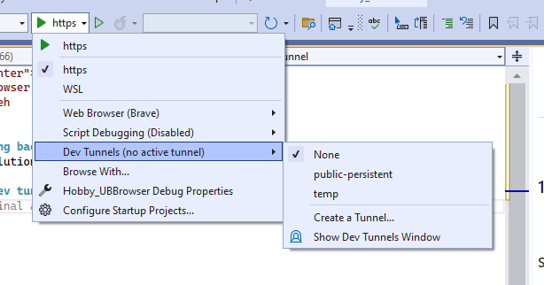
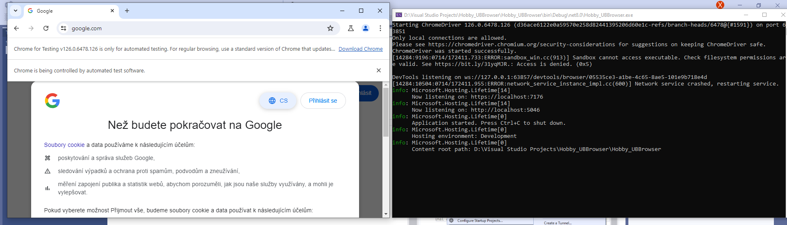
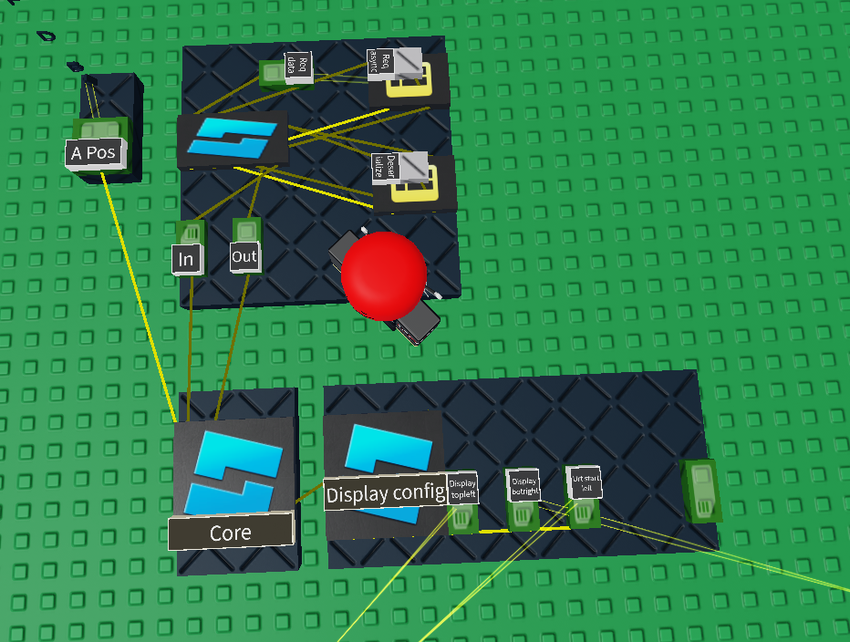

<div align="center">
	<h1> UB Browser </h1>
	by xopabyteh
</div>

### 1. Launching backend from visual studio
1. Open the solution (.sln) in Visual Studio

#### Start a dev tunnel
2. https > Dev Tunnels > Create a Tunnel


3. Then start the server with CTRL + F5, that should open up a console window
and a chrome browser


(To close it, hit ctrl + c in the console window)

### 2. Setup code blocks


* The core contains logic for fetching the screen using the 
*HTTP Screen facade* and then updating the physical screen

1. Rerun the Display config code block, so it refreshes the variable inputs
2. Configure the code in core, mainly the apiBaseAddres.
Set the correct **dev tunnel** address in the same format as is below
{hostAdress}/api

```lua
-- <Parameters>
local apiBaseAddres = "https://5pxjmc47-7176.euw.devtunnels.ms/api"
local displayUpdateMaxBatchSize = 48
local displayUpdateBatchWait = 0.3
local letterPartSize = 1
local amOfDisplayThreads = 2
-- </Parameters>
```
3. Rerun core code block